**1.尝试理解计算机如何计算**
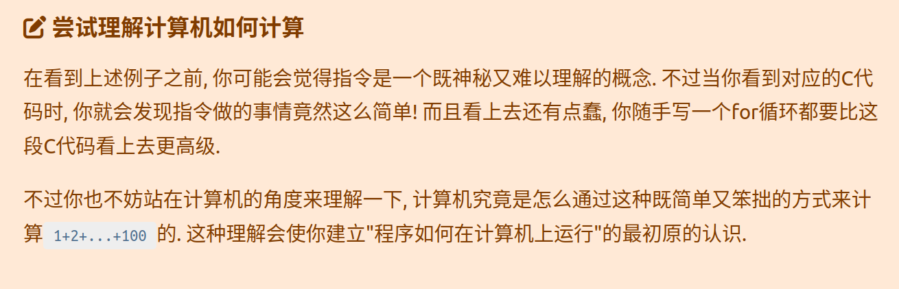
```asm
// PC: instruction    | // label: statement
0: mov  r1, 0         |  pc0: r1 = 0;
1: mov  r2, 0         |  pc1: r2 = 0;
2: addi r2, r2, 1     |  pc2: r2 = r2 + 1;
3: add  r1, r1, r2    |  pc3: r1 = r1 + r2;
4: blt  r2, 100, 2    |  pc4: if (r2 < 100) goto pc2;   // branch if less than
5: jmp 5              |  pc5: goto pc5;
```
靠逐一递r2并加到r1,计算机会把复杂问题分解为简单的指令集合  

**2.从状态机视角理解程序运行**  
```txt
(PC, r1, r2)：(0, x, x) -> (1, 0, x) -> (2, 0, 0) -> (3, 0, 1) -> (4, 1, 1) -> (5, 1, 1) -> (3, 1, 2) -> (4, 3, 2) -> (5, 3, 2)-> ......-> (3, 4851,99) -> (4, 4950, 99) -> (5, 4950, 99) -> (3, 4950, 100) -> (4, 5050, 100) -> (5, 5050, 100) -> (6, 5050, 100)
```

**3.删除错误信息**
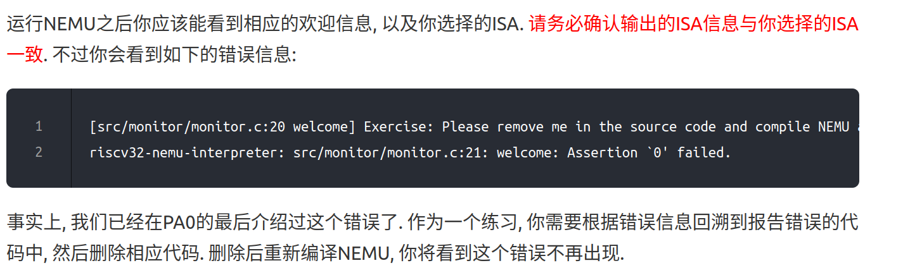
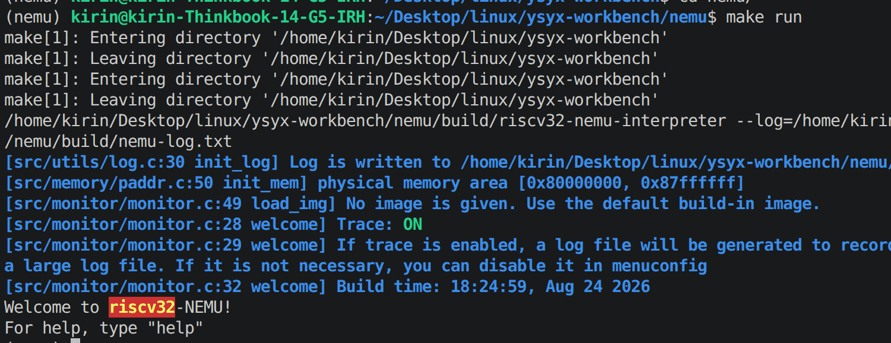

**4.究竟要执行多久?**   
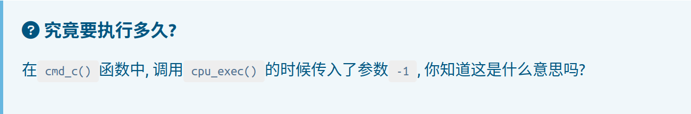
uint64_t将-1转化为了0xffffffff,很大的一个数，效果是"一直执行到程序结束"

**5.优美地退出**
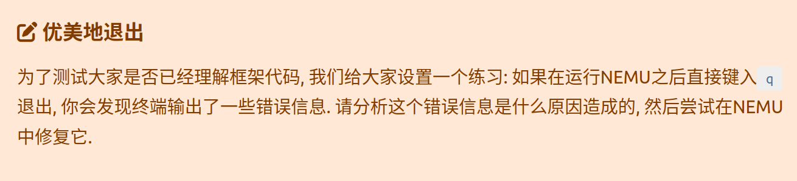
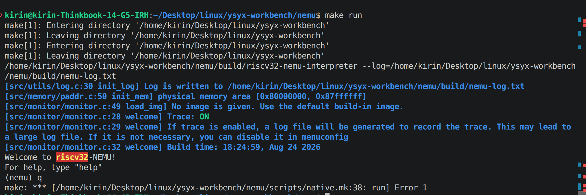
看/home/kirin/Desktop/linux/ysyx-workbench/nemu/src/monitor/sdb/sdb.c
```c
static struct {
  const char *name;
  const char *description;
  int (*handler) (char *);
} cmd_table [] = {
  { "help", "Display information about all supported commands", cmd_help },
  { "c", "Continue the execution of the program", cmd_c },
  { "q", "Exit NEMU", cmd_q },
```

并调用：  
```c
int i;
    for (i = 0; i < NR_CMD; i ++) {
      if (strcmp(cmd, cmd_table[i].name) == 0) {
        if (cmd_table[i].handler(args) < 0) { return; }//等价于cmd_q(args)
        break;
      }
```
发现：
```
static int cmd_q(char *args) {
  return -1;
}
```
导致异常退出；
故改为:
```c
static int cmd_q(char *args) {
  nemu_state.state=NEMU_QUIT;
  exit(0);
}
```
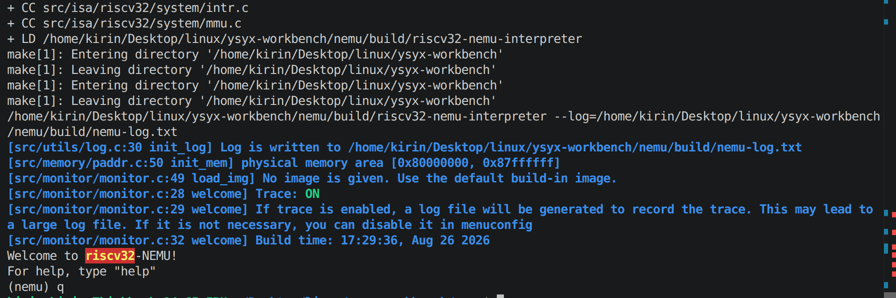

**6.单步执行**
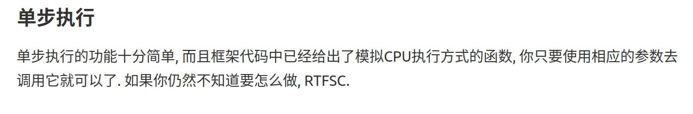
/home/kirin/Desktop/linux/ysyx-workbench/nemu/src/cpu/cpu-exec.c中的单步执行函数：
```c
static void execute(uint64_t n) {
  Decode s;
  for (;n > 0; n --) {
    exec_once(&s, cpu.pc);
    g_nr_guest_inst ++;
    trace_and_difftest(&s, cpu.pc);
    if (nemu_state.state != NEMU_RUNNING) break;
    IFDEF(CONFIG_DEVICE, device_update());
  }
}
```
而这个函数又被cpu_exec调用
```c
void cpu_exec(uint64_t n) {
  g_print_step = (n < MAX_INST_TO_PRINT);
  switch (nemu_state.state) {
    case NEMU_END: case NEMU_ABORT: case NEMU_QUIT:
      printf("Program execution has ended. To restart the program, exit NEMU and run again.\n");
      return;
    default: nemu_state.state = NEMU_RUNNING;
  }

  uint64_t timer_start = get_time();

  execute(n);
  ```
  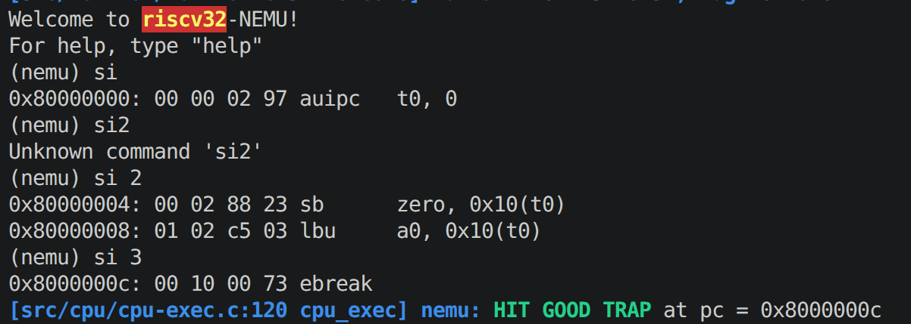
```c
static const uint32_t img [] = {
  0x00000297,  // auipc t0,0
  0x00028823,  // sb  zero,16(t0)
  0x0102c503,  // lbu a0,16(t0)
  0x00100073,  // ebreak (used as nemu_trap)
  0xdeadbeef,  // some data
};
```
对照打印的内置程序发现达成目的

  **7.打印寄存器**
  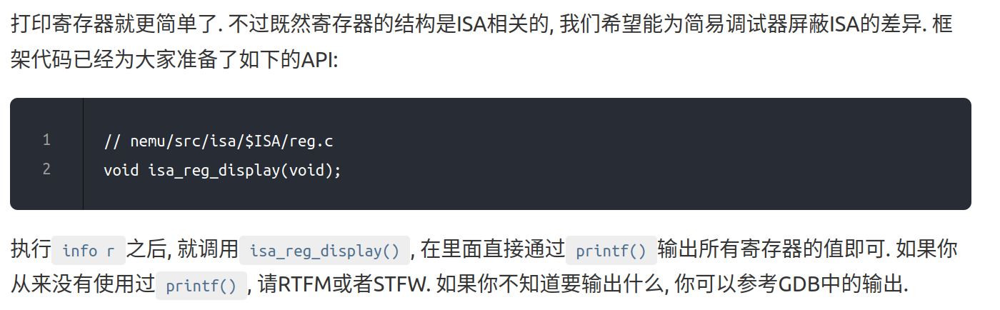
  gpr定义:
  ```c
  typedef struct {
  word_t gpr[MUXDEF(CONFIG_RVE, 16, 32)];
  vaddr_t pc;
} MUXDEF(CONFIG_RV64, riscv64_CPU_state, riscv32_CPU_state);
```
补全接口
```c
void isa_reg_display() {
  for(int i=0;i<4;i++)
  {
    for(int j=0;j<8;j++)
    {
      printf("%s:0x%08x\t",regs[8*i+j],cpu.gpr[8*i+j]);
    }
    printf("\n");
  }
}
```
补全调用
```c
static int cmd_info(char *args)
{
  args=strtok(NULL, "");
  if(args==NULL)printf("Usage:info w/r");
  if(*args=='r')
  {
     isa_reg_display();
  }
  return 0;
}
```
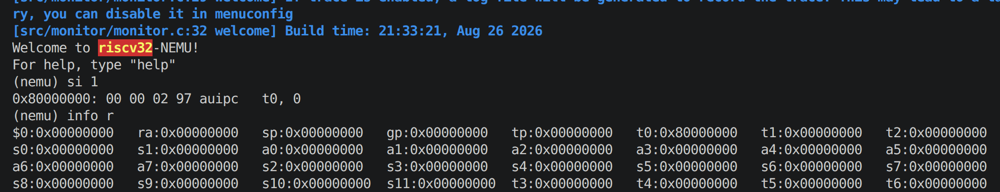

**8.扫描内存**
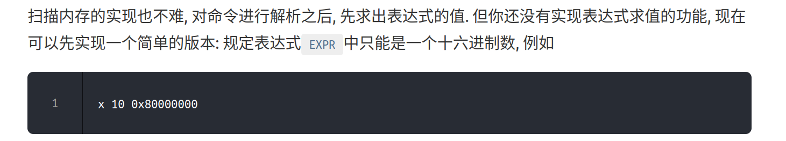
```c
static int cmd_x(char *args)
{ char *len=strtok(NULL, " ");
  args=strtok(NULL, " ");
  uint32_t addr=strtol(args,NULL,16);
  uint32_t N=strtol(len,NULL,10);
   for(int i=0;i<N;i++)
  {
    word_t mem=paddr_read(addr+i*4, 4);
    printf("0x%08x\t",mem);
    if((i+1)%4==0){
    printf("\n");
  }
}
  printf("\n");
  return 0;
}
```
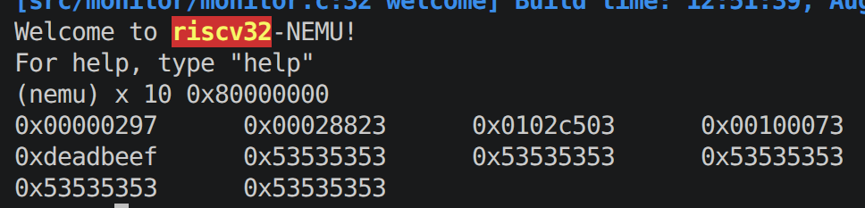
```c
static const uint32_t img [] = {
  0x00000297,  // auipc t0,0
  0x00028823,  // sb  zero,16(t0)
  0x0102c503,  // lbu a0,16(t0)
  0x00100073,  // ebreak (used as nemu_trap)
  0xdeadbeef,  // some data
};
```
内置程序只有以上指令，剩下的内存里是没初始化的垃圾值  

 **9.实现算术表达式的词法分析**
 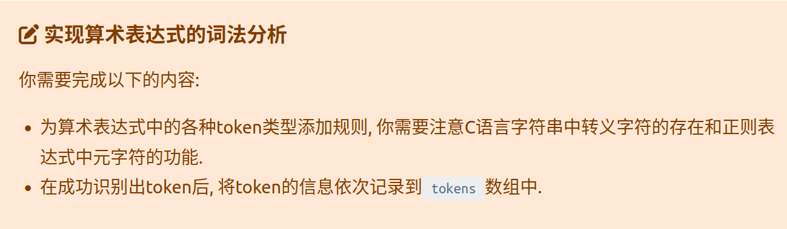
 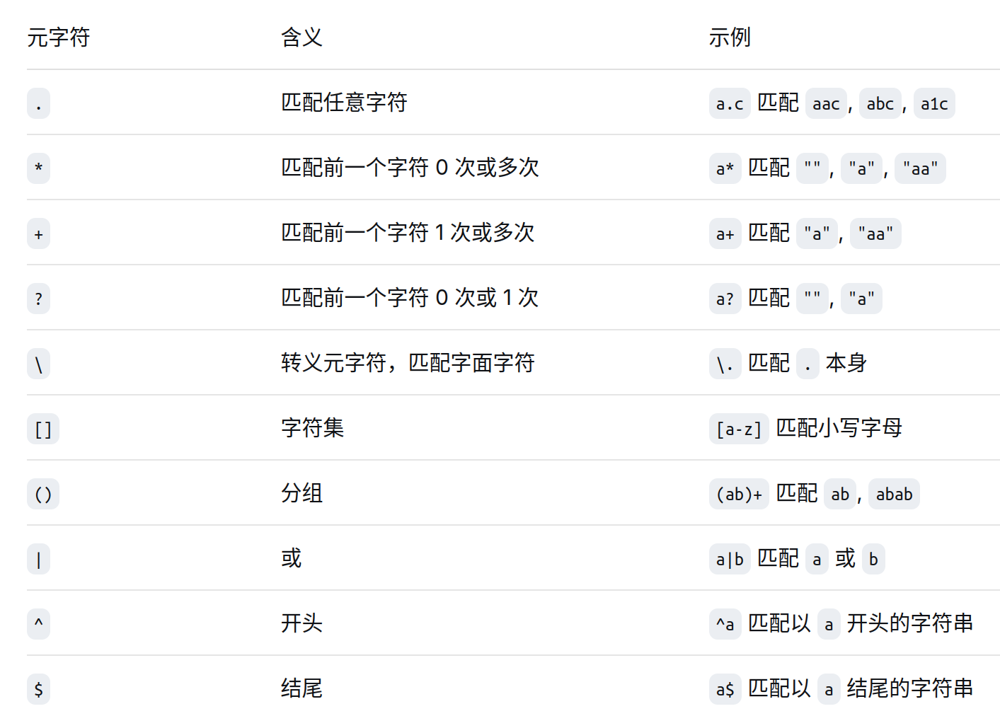
 元字符要转义
 ```c
 static struct rule {
  const char *regex;
  int token_type;
} rules[] = {

  /* TODO: Add more rules.
   * Pay attention to the precedence level of different rules.
   */

  {" +", TK_NOTYPE},    // spaces
  {"\\+", '+'},         // plus
  {"-", '-'},           //sub
  {"\\*",'*'},          //multi
  {"/",'/'},            //div
  {"==", TK_EQ},        // equal
  {"!=",TK_NEQ},        //not equal
  {"<=",TK_LE},         //less equal
  {">=",TK_GE},         //greater equal
  {"&&",TK_AND},        //logical and
 {"\\|\\|",TK_OR},         //logical or
 {"\\(",'('},            //left brace
 {"\\)",')'},            //right brace
 {"[0-9]+",TK_NUM},    //number
 {"\\$[a-zA-Z0-9]",TK_REG}//register
};
```
注册规则
```c
nr_token = 0;

  while (e[position] != '\0') {
    /* Try all rules one by one. */
    for (i = 0; i < NR_REGEX; i ++) {
      if (regexec(&re[i], e + position, 1, &pmatch, 0) == 0 && pmatch.rm_so == 0) {
        char *substr_start = e + position;
        int substr_len = pmatch.rm_eo;

        Log("match rules[%d] = \"%s\" at position %d with len %d: %.*s",
            i, rules[i].regex, position, substr_len, substr_len, substr_start);

        position += substr_len;

        /* TODO: Now a new token is recognized with rules[i]. Add codes
         * to record the token in the array `tokens'. For certain types
         * of tokens, some extra actions should be performed.
         */

        switch (rules[i].token_type) {
         case TK_NOTYPE:
            break;
          default: 
          {
            tokens[nr_token].type=rules[i].token_type;
            strncpy(tokens[nr_token].str, substr_start, substr_len);
            tokens[nr_token].str[substr_len] = '\0';
            nr_token++;
            break;
          }
        }
        break;
      }
    }

    if (i == NR_REGEX) {
      printf("no match at position %d\n%s\n%*.s^\n", position, e, position, "");
      return false;
    }
  }
```
记录规则  

**10.实现算术表达式的递归求值**
```c
static int cmd_p(char *args)
{ if(args==NULL)printf("Usage:p <expression>\n");
  bool success=true;
  word_t ret=expr(args,&success);
  if(success==false)printf("make token fail!");
  printf("%d\n",ret);
  return 0;
}
```
在sdb.c注册
```c
word_t expr(char *e, bool *success) {
  if (!make_token(e)) {
    *success = false;
    return 0;
  }
  return eval(0,nr_token-1,success);
}
```
先正则识别写入tokens[],再调用eval计算
```c
static bool make_token(char *e) {
  int position = 0;
  int i;
  regmatch_t pmatch;

  nr_token = 0;

  while (e[position] != '\0') {
    /* Try all rules one by one. */
    for (i = 0; i < NR_REGEX; i ++) {
      if (regexec(&re[i], e + position, 1, &pmatch, 0) == 0 && pmatch.rm_so == 0) {
        char *substr_start = e + position;
        int substr_len = pmatch.rm_eo;

        Log("match rules[%d] = \"%s\" at position %d with len %d: %.*s",
            i, rules[i].regex, position, substr_len, substr_len, substr_start);

        position += substr_len;

        /* TODO: Now a new token is recognized with rules[i]. Add codes
         * to record the token in the array `tokens'. For certain types
         * of tokens, some extra actions should be performed.
         */

        switch (rules[i].token_type) {
         case TK_NOTYPE:
            break;
          default: 
          {
            tokens[nr_token].type=rules[i].token_type;
            strncpy(tokens[nr_token].str, substr_start, substr_len);
            tokens[nr_token].str[substr_len] = '\0';
            nr_token++;
            break;
          }
        }
        break;
      }
    }
```
识别的话注意最后的补'\0'确保为合法字符串数组，以及空格的跳过

```c
word_t eval(int p, int q, bool *success) {
  if (p > q) {
    /* Bad expression */
    *success=false;
    return 0;
  }
  else if (p == q) {
    /* Single token.
     * For now this token should be a number.
     * Return the value of the number.
     */
    if(tokens[p].type!=TK_NUM&&tokens[p].type!=TK_REG)
    {
      *success=false;
      return 0;
    }
    word_t value=strtol(tokens[p].str,NULL,10);
    return value;
  }
  else if (check_parentheses(p, q) == true) {
    /* The expression is surrounded by a matched pair of parentheses.
     * If that is the case, just throw away the parentheses.
     */
    return eval(p + 1, q - 1,success);
  }
  else {
    int op = find_main_op(p,q);
    word_t val1 = eval(p, op - 1,success);
    word_t val2 = eval(op + 1, q,success);

    switch (tokens[op].type) {
      case '+': return val1 + val2;
      case '-': return val1-val2;
      case '*': return val1*val2;
      case '/': 
      if(val2==0)
      {
        success=false;
        return 0;
      }
      return val1/val2;
      default: assert(0);
    }
  }
}
```
然后就是eval函数，找到主表达式计算
```c
int check_parentheses(int p,int q)
 {if(tokens[p].type=='('&&tokens[q].type==')')
  {
    int pair=0;
    for(int i=p;i<=q;i++)
    {
        if(tokens[i].type=='(') pair--;
        else if (tokens[i].type==')') pair++;
        if (pair==0)return i==q;
    }
  }
  return false;
 }
 int find_main_op(int p,int q)
 {
    int pairs=0;
    int priority=0;
    int ret=-1;
  for(int i=p;i<=q;i++)
  {
    if(tokens[i].type==TK_NUM || tokens[i].type==TK_REG)
    {
      continue;
    }
    if(tokens[i].type=='(')pairs++;
    else if(tokens[i].type==')')
    {
        if(pairs==0)return -1;
        pairs--;
    }
    else if(pairs>0)continue;
    else{
      if(tokens[i].type=='*'||tokens[i].type=='/')
     { priority=1;
      ret=i;
     }
     if(tokens[i].type=='+'||tokens[i].type=='-')
     {
      if(priority!=1)ret=i;
     }
    }
  }
   if(pairs!=0)return -1;
   return ret;
 }
 ```
 找到主表达式（最右而且优先级高）和去括号（防止括号内是完整表达式）如上
 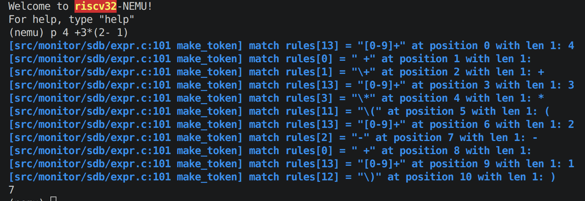

 **11.实现带有负数的算术表达式的求值 (选做)**
 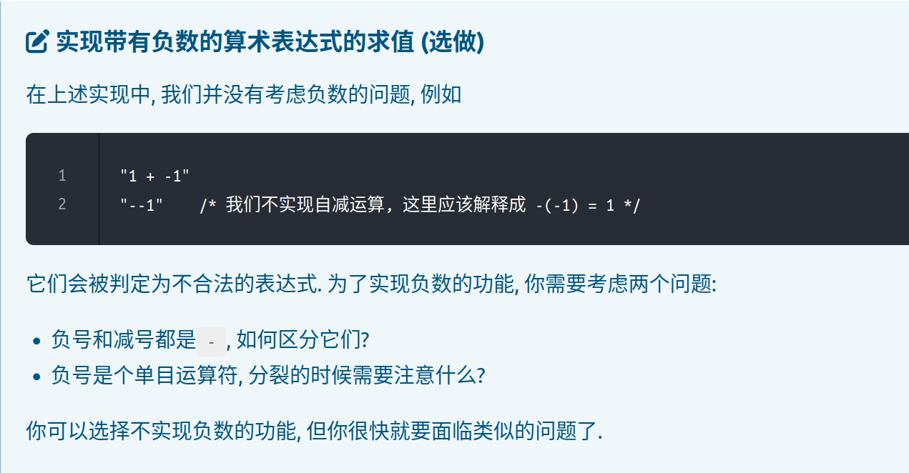
 ```c

        switch (rules[i].token_type) {
         case TK_NOTYPE:
            break;
          case '-':
            bool is_neg=false;
            if(nr_token==0)
              is_neg=true;
            else{
              int pre_token_type=tokens[nr_token-1].type;
              if(pre_token_type=='('||pre_token_type=='*'||pre_token_type=='-'||pre_token_type=='/'||pre_token_type=='+'||pre_token_type==TK_EQ||pre_token_type==TK_AND||pre_token_type==TK_GE||pre_token_type==TK_LE||pre_token_type==TK_NEQ||pre_token_type==TK_OR)
              {
                is_neg=true;
              }
            }
             tokens[nr_token].type=(is_neg==false)?'-':TK_NEG;
             strncpy(tokens[nr_token].str, substr_start, substr_len);
             tokens[nr_token].str[substr_len] = '\0';
             nr_token++;
              break;
          default: 
          {
            tokens[nr_token].type=rules[i].token_type;
            strncpy(tokens[nr_token].str, substr_start, substr_len);
            tokens[nr_token].str[substr_len] = '\0';
            nr_token++;
            break;
          }
        }
```
加了规则修正，就是运算符和左括号后面的和第一个是负号
在eval里取反
```c
  else {
    word_t op = find_main_op(p,q);
        if (op == -1) {
      if (tokens[p].type == TK_NEG) {
        return -eval(p + 1, q, success);
      }

      *success = false;
      return 0;
    }

    word_t val1 = eval(p, op - 1,success);
    word_t val2 = eval(op + 1, q,success);
  ```
  同时也实现了寄存器取值
  ```c
  word_t isa_reg_str2val(const char *s, bool *success) {
  for(int i=0;i<32;i++)
  {
    if(strcmp(s,regs[i])==0)
    {
      word_t value=cpu.gpr[i];
      *success=true;
      return value;
    }
  }
  printf("don't find the reg!");
  *success=false;
  return 0;
}
```
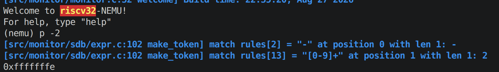
 **12.实现表达式生成器**
 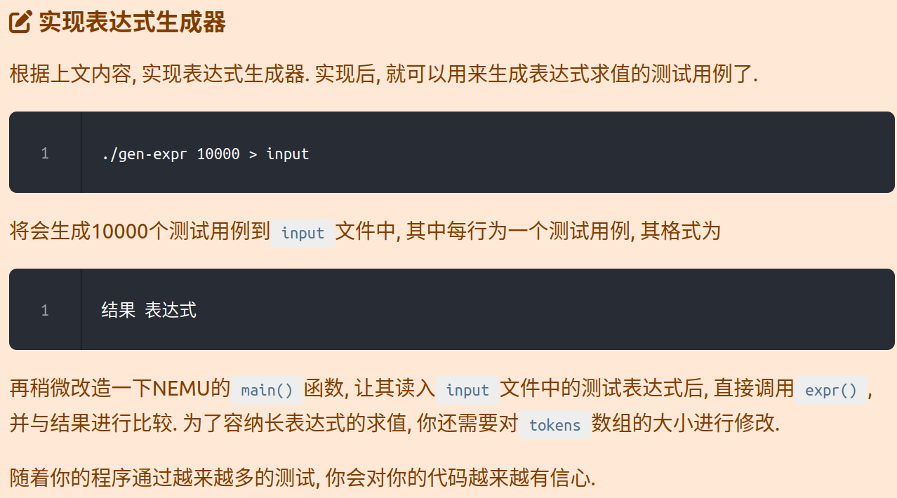
 ```c
#include <stdint.h>
#include <stdio.h>
#include <stdlib.h>
#include <time.h>
#include <assert.h>
#include <string.h>

// this should be enough
static char buf[65536] = {};
static char code_buf[65536 + 128] = {}; // a little larger than `buf`
static char *code_format =
"#include <stdio.h>\n"
"int main() { "
"  unsigned result = %s; "
"  printf(\"%%u\", result); "
"  return 0; "
"}";
static int pos=0;
static int choose(int num)
{
  return rand()%num;
}
static void gen_num()
{
  char num[32];
  uint32_t value=rand()%10000000;
  int len=snprintf(num,sizeof(num),"%uu",value);
  if(len+pos>=sizeof(buf)||len<0)return;
  memcpy(buf+pos, num, len);
  pos+=len;
  buf[pos]='\0';
}
static void gen(char s)
{
  if(pos+1<sizeof(buf))
  {
  buf[pos]=s;
  pos++;
  }
  buf[pos]='\0';
}
static void gen_rand_op()
{
  char op[4]={'+','-','/','*'};
  gen(op[rand()%4]);
}
static void gen_rand_expr(int deep) {
  if(deep>10)
  {gen_num();
    return;
  }
  switch (choose(3)) {
    case 0: gen_num(); break;
    case 1: gen('('); gen_rand_expr(deep+1); gen(')'); break;
    default: gen_rand_expr(deep+1); gen_rand_op(); gen_rand_expr(deep+1); break;
  }
}

int main(int argc, char *argv[]) {
  int seed = time(0);
  srand(seed);
  int loop = 1;
  if (argc > 1) {
    sscanf(argv[1], "%d", &loop);
  }
  int i;
  for (i = 0; i < loop; i ++) {
    buf[0]='\0';
    pos=0;
    gen_rand_expr(0);

    sprintf(code_buf, code_format, buf);

    FILE *fp = fopen("/tmp/.code.c", "w");
    assert(fp != NULL);
    fputs(code_buf, fp);
    fclose(fp);

    int ret = system("gcc -fsanitize=undefined "
      "-fno-sanitize-recover=undefined "
      "/tmp/.code.c -o /tmp/.expr");
    if (ret != 0) continue;

    fp = popen("/tmp/.expr", "r");
    assert(fp != NULL);

    int result;
    ret = fscanf(fp, "%d", &result);
    int status=pclose(fp);
    if (ret != 1 ||!WIFEXITED(status)||WEXITSTATUS(status) != 0) {//去掉分母是0的
         continue;
      }
    printf("%u %s\n", result, buf);
  }
  return 0;
}
```
生成了input文件，格式类似：
```text
0 3485788u/((7725605u))
330964 (330964u)
3698779152 (((((406905u)*((((2997346u*3925000u*4672985u))))))))
5658924 5658924u
```
在sdb.c加调用函数：
```c
void test_expr()
{
  FILE* fp=fopen("/home/kirin/Desktop/linux/ysyx-workbench/nemu/tools/gen-expr/input","r");
  if(fp==NULL)perror("can't load file");
  word_t right_res;
  char *e=NULL;
  size_t len=0;
  bool success=false;
  while(1){
  if(fscanf(fp,"%u",&right_res)==-1)break;
  int read=getline(&e,&len,fp);
  e[read-1]='\0';
  word_t res=expr(e,&success);
  assert(success);
  if(res!=right_res)
  {
    printf("expect:%u,get:%u",right_res,res);
    assert(0);
  }
  }
  printf("pass the expr test!\n");
}
```
并且在sdb初始化的时候调用
```c
void init_sdb() {
  /* Compile the regular expressions. */
  init_regex();
  test_expr();
  /* Initialize the watchpoint pool. */
  init_wp_pool();
}
```
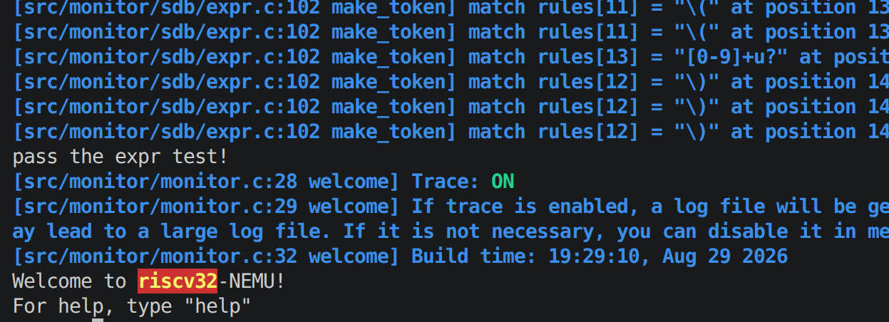
**13.扩展表达式求值的功能**
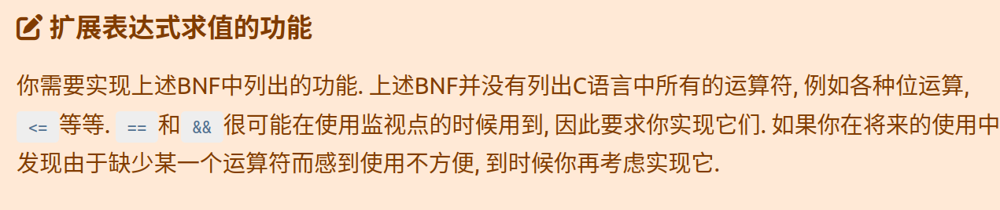
添加规则;
```c
  {"0[xX][0-9a-f]+",TK_HNUM},//16进制要放10进制前面
 {"\\$[a-zA-Z0-9]+",TK_REG}//register
 ```
 识别后的处理：
 ```c
    if(tokens[p].type==TK_HNUM)
     {
     word_t value=strtol(tokens[p].str,NULL,16);
     return value;
    }
    if (tokens[p].type==TK_REG) {
     word_t value=isa_reg_str2val(tokens[p].str, success);
     return value;
    }

```
```c
word_t isa_reg_str2val(const char *s, bool *success) {
  if(s[0]=='$')s++;
  for(int i=0;i<32;i++)
  { 
    if(strcmp(s,regs[i])==0)
    {
      word_t value=cpu.gpr[i];
      *success=true;
      return value;
    }
  }
  printf("don't find the reg!");
  *success=false;
  return 0;
}
```
注意$号
指针和负号方法一样
```c
   case'*':
              bool is_pointer=false;
            if(nr_token==0)
              is_pointer=true;
            else{
              if(pre_token_type=='('||pre_token_type=='*'||pre_token_type=='-'||pre_token_type=='/'||pre_token_type=='+'||pre_token_type==TK_EQ||pre_token_type==TK_AND||pre_token_type==TK_GE||pre_token_type==TK_LE||pre_token_type==TK_NEQ||pre_token_type==TK_OR||pre_token_type==TK_NEG)
              {
                is_pointer=true;
              }
            }
             tokens[nr_token].type=(is_pointer==false)?'*':TK_POINTER;
              break;
  ```
```c
  else if(tokens[p].type==TK_POINTER){
      word_t value=eval(p+1,q, success);
      return paddr_read(value,4);
  }
```
<=. ==,&&,>=,>,<,||,!=:
```c
      case TK_OR: return val1||val2;
      case TK_EQ: return val1==val2;
      case TK_NEQ:return val1!=val2;
      case TK_AND:return val1&&val2;
      case TK_L:return val1>val2;
      case TK_GE:return val1>=val2;
      case TK_LE:return val1<=val2;
      case TK_G:return val1<val2;
```
注意优先级：
```c
int find_main_op(int p,int q)
 {  int priority=9;
    int pairs=0;
    int ret=-1;
  for(int i=p;i<=q;i++)
  {
    if(tokens[i].type==TK_NUM || tokens[i].type==TK_REG)
    {
      continue;
    }
    if(tokens[i].type=='(')pairs++;
    else if(tokens[i].type==')')
    {
        if(pairs==0)return -1;
        pairs--;
    }
    else if(pairs>0)continue;
    else{
      if(tokens[i].type==TK_OR)
      {
        ret=i;
        priority=0;
      }
      if((tokens[i].type==TK_AND)&&priority>0)
      {
        ret=i;
        priority=1;
      }
      if((tokens[i].type==TK_EQ||tokens[i].type==TK_NEQ)&&priority>1)
      { 
        ret=i;
        priority=2;
      }
      if((tokens[i].type==TK_L||tokens[i].type==TK_G||tokens[i].type==TK_GE||tokens[i].type==TK_LE)&&priority>2)
      {
        ret=i;
        priority=3;
      }
      if((tokens[i].type=='+'||tokens[i].type=='-')&&priority>3)
     { 
      ret=i;
      priority=4;
     }
     if((tokens[i].type=='*'||tokens[i].type=='/')&&priority>4)
     {
      ret=i;
      priority=5;
     }
    }
  }
   if(pairs!=0)return -1;
   return ret;
 }
```
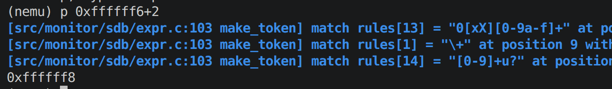
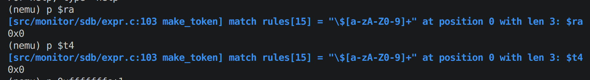
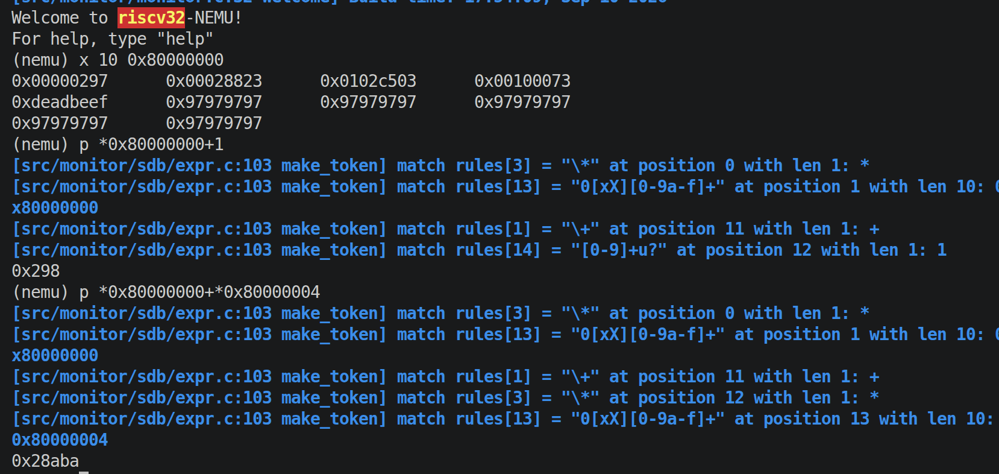
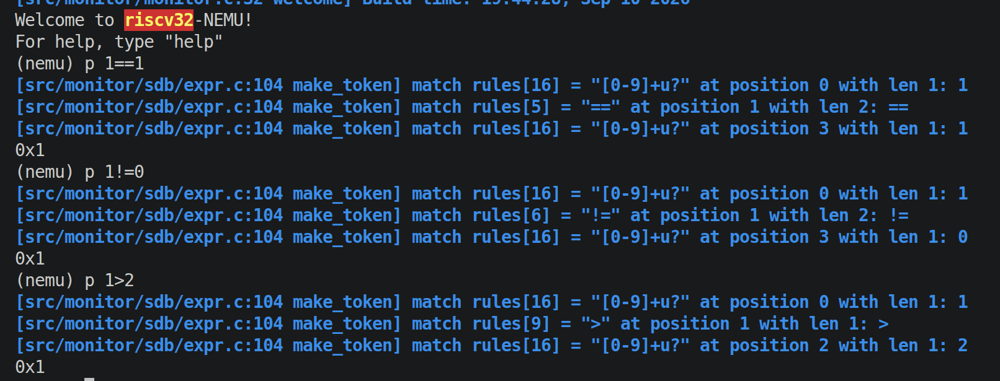

**14.实现监视点池的管理**
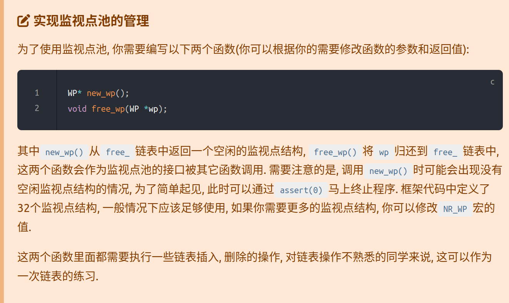

没有空闲监视点通过assert(0)马上终止程序：
```c
static WP* new_wp() {
  assert(free_);
  WP* ret = free_;
  free_ = free_->next;
  ret->next = head;
  head = ret;
  return ret;
}
void free_wp(WP* wp){
  if(wp==NULL){
    return;
  }
  wp->next = free_;
  free_ = wp;
}

```
**15.对static理解**

为了仅限内部函数访问，防止其他程序命名相同变量导致错误

**15.实现监视点**
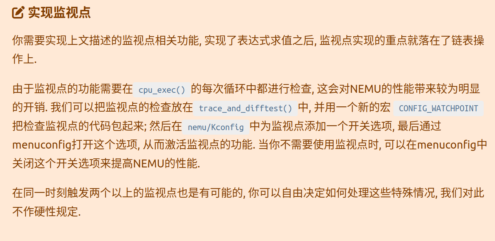
添加规则并编写函数：
```c
static int cmd_info(char *args)
{
  args=strtok(NULL, " ");
  if(args==NULL){printf("Usage:info w/r");
  assert(0);
  }
  if(*args=='r')
  {
     isa_reg_display();
  }
  if(*args=='w')
  {
    wp_display();
  }
  return 0;
}
static int cmd_w(char *args)
{ bool success;
  if(args==NULL){printf("Usage:w <expression>");
  assert(0);}
  word_t ret=expr(args, &success);
  if(success==false)printf("expr fail!");
  else{
    create_watchpoint(args,ret);
  }
  return 0;
}
static int cmd_d(char *args){
   if(args==NULL){printf("Usage:d <expression>");
  assert(0);}
  uint32_t NO=strtol(args,NULL,10);
  delete_watchpoint(NO);
  return 0;
}
```
在watchpoint.c添加对应支持：
```c
void wp_display(){
  WP* temp=head;
  if(temp==NULL)
  {printf("No watchpoint available\n");
    return;
  }
  else{
    while(temp){
      printf("%d:%-8s\n",temp->NO,temp->expr);
      temp=temp->next;
    }
  }
}
void create_watchpoint(char *args, word_t ret){
  WP* new=new_wp();
  strcpy(new->expr,args);
  new->old_value=ret;
  printf("create watchpoint %d:%s\n",new->NO,new->expr);
}
void delete_watchpoint(uint32_t NO){
  assert(NO<NR_WP);
  WP* del=&wp_pool[NO];
  printf("delete watchpoint %d:%s\n",del->NO,del->expr);
  free_wp(del);
}

```
在Kconfig加规则:  
```txt
config WATCHPOINT
  depends on TRACE
  bool "Enable watchpoint"
  default n

```
在kconfig启动watchpoint:
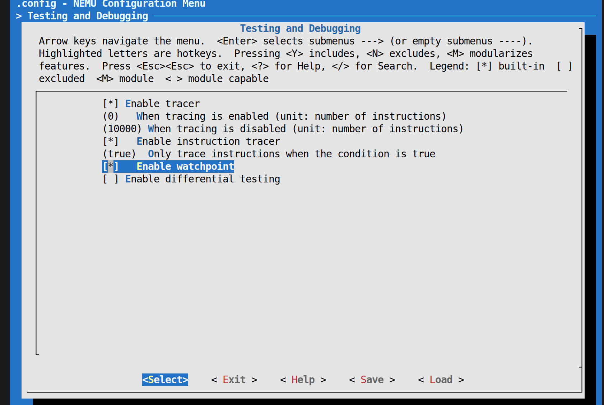
在cpu-exe.c添加：
```c
static void trace_and_difftest(Decode *_this, vaddr_t dnpc) {
#ifdef CONFIG_ITRACE_COND
  if (ITRACE_COND) { log_write("%s\n", _this->logbuf); }
#endif
  if (g_print_step) { IFDEF(CONFIG_ITRACE, puts(_this->logbuf)); }
  IFDEF(CONFIG_DIFFTEST, difftest_step(_this->pc, dnpc));
#ifdef CONFIG_WATCHPOINT
bool change;
 watchpoint_diff(&change);
 if(change){nemu_state.state = NEMU_STOP;
  printf("stop due to watchpoint change!\n");
}
 #endif
}

```
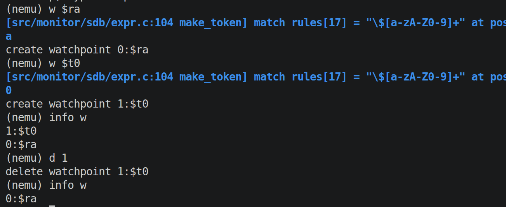
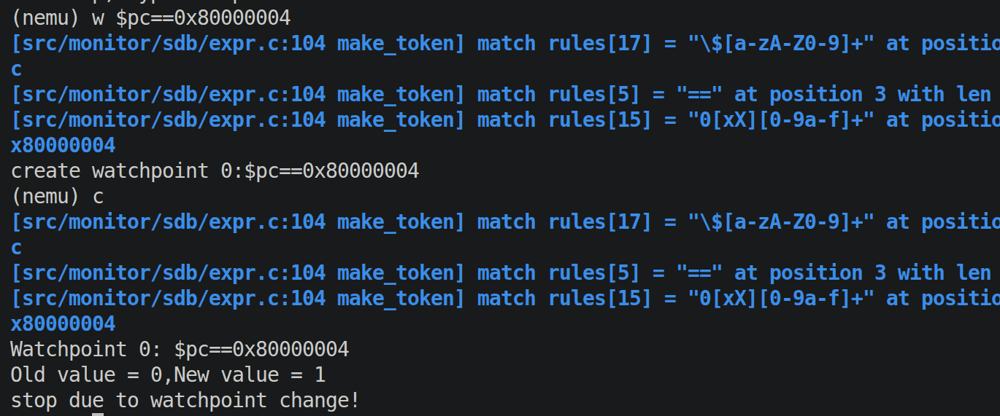