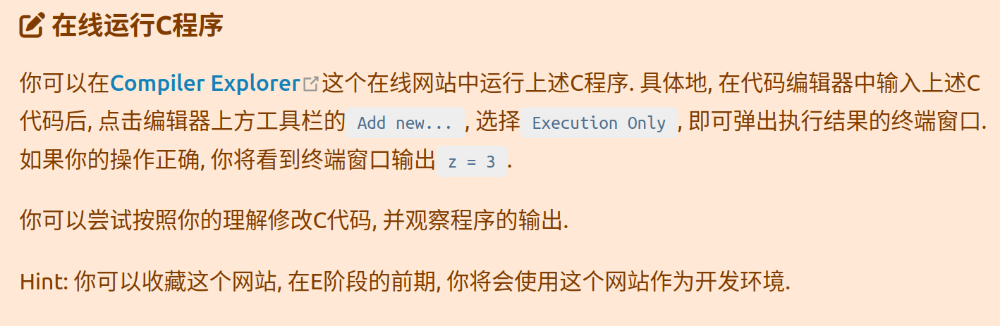
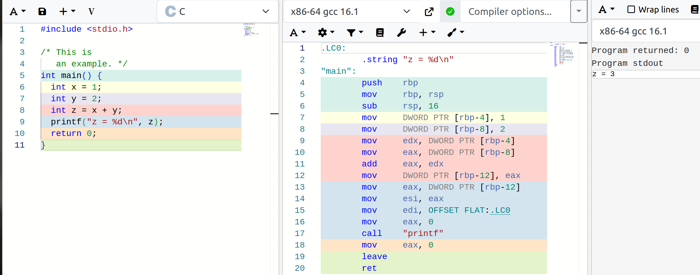
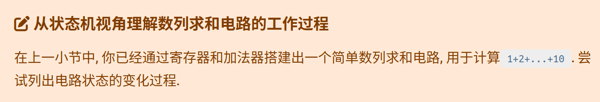
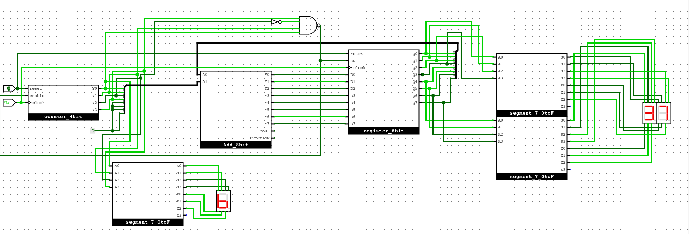
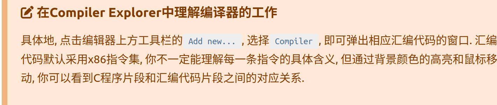

**1. 继续执行上述指令**

```asm
0: li r0, 10   # 这里是十进制的10
1: li r1, 0
2: li r2, 0
3: li r3, 1
4: add r1, r1, r3
5: add r2, r2, r1
6: bner0 r1, 4
7: bner0 r3, 7
```
```txt
PC r0 r1 r2 r3
(0, 0, 0, 0, 0)   # 初始状态
(1, 10, 0, 0, 0)  # 执行PC为0的指令后, r0更新为10, PC更新为下一条指令的位置
(2, 10, 0, 0, 0)  # 执行PC为1的指令后, r1更新为0, PC更新为下一条指令的位置
(3, 10, 0, 0, 0)  # 执行PC为2的指令后, r2更新为0, PC更新为下一条指令的位置
(4, 10, 0, 0, 1)  # 执行PC为3的指令后, r3更新为1, PC更新为下一条指令的位置
(5, 10, 1, 0, 1)  # 执行PC为4的指令后, r1更新为r1+r3, PC更新为下一条指令的位置
(6, 10, 1, 1, 1)  # 执行PC为5的指令后, r2更新为r2+r1, PC更新为下一条指令的位置
(4, 10, 1, 1, 1)  # 执行PC为6的指令后, 因r1不等于r0, 故PC更新为4
(5, 10, 2, 1, 1)  # 执行PC为4的指令后, r1更新为r1+r3, PC更新为下一条指令的位置
```
继续推演：
```txt
PC r0 r1 r2 r3
(0, 0, 0, 0, 0)   # 初始状态
(1, 10, 0, 0, 0)  # 执行PC为0的指令后, r0更新为10, PC更新为下一条指令的位置
(2, 10, 0, 0, 0)  # 执行PC为1的指令后, r1更新为0, PC更新为下一条指令的位置
(3, 10, 0, 0, 0)  # 执行PC为2的指令后, r2更新为0, PC更新为下一条指令的位置
(4, 10, 0, 0, 1)  # 执行PC为3的指令后, r3更新为1, PC更新为下一条指令的位置
(5, 10, 1, 0, 1)  # 执行PC为4的指令后, r1更新为r1+r3, PC更新为下一条指令的位置
(6, 10, 1, 1, 1)  # 执行PC为5的指令后, r2更新为r2+r1, PC更新为下一条指令的位置
(4, 10, 1, 1, 1)  # 执行PC为6的指令后, 因r1不等于r0, 故PC更新为4
(5, 10, 2, 1, 1)  # 执行PC为4的指令后, r1更新为r1+r3, PC更新为下一条指令的位置
(6, 10, 2, 3, 1)  # 执行PC为5的指令后, r2更新为r2+r1, PC更新为下一条指令的位置
(4, 10, 2, 3, 1)  # 执行PC为6的指令后, 因r1不等于r0, 故PC更新为4
(5, 10, 3, 3, 1)  # 执行PC为4的指令后, r1更新为r1+r3, PC更新为下一条指令的位置
(6, 10, 3, 3, 1)  # 执行PC为5的指令后, r2更新为r2+r1, PC更新为下一条指令的位置
(4, 10, 3, 6, 1)  # 执行PC为6的指令后, 因r1不等于r0, 故PC更新为4
(5, 10, 4, 6, 1)  # 执行PC为4的指令后, r1更新为r1+r3, PC更新为下一条指令的位置
(6, 10, 4, 10, 1)  # 执行PC为5的指令后, r2更新为r2+r1, PC更新为下一条指令的位置
(4, 10, 4, 10, 1)  # 执行PC为6的指令后, 因r1不等于r0, 故PC更新为4
(5, 10, 5, 10, 1)  # 执行PC为4的指令后, r1更新为r1+r3, PC更新为下一条指令的位置
(6, 10, 5, 15, 1)  # 执行PC为5的指令后, r2更新为r2+r1, PC更新为下一条指令的位置
(4, 10, 5, 15, 1)  # 执行PC为6的指令后, 因r1不等于r0, 故PC更新为4
(5, 10, 6, 15, 1)  # 执行PC为4的指令后, r1更新为r1+r3, PC更新为下一条指令的位置
(6, 10, 6, 21, 1)  # 执行PC为5的指令后, r2更新为r2+r1, PC更新为下一条指令的位置
(4, 10, 6, 21, 1)  # 执行PC为6的指令后, 因r1不等于r0, 故PC更新为4
(5, 10, 7, 21, 1)  # 执行PC为4的指令后, r1更新为r1+r3, PC更新为下一条指令的位置
(6, 10, 7, 28, 1)  # 执行PC为5的指令后, r2更新为r2+r1, PC更新为下一条指令的位置
(4, 10, 7, 28, 1)  # 执行PC为6的指令后, 因r1不等于r0, 故PC更新为4
(5, 10, 8, 28, 1)  # 执行PC为4的指令后, r1更新为r1+r3, PC更新为下一条指令的位置
(6, 10, 8, 36, 1)  # 执行PC为5的指令后, r2更新为r2+r1, PC更新为下一条指令的位置
(4, 10, 8, 36, 1)  # 执行PC为6的指令后, 因r1不等于r0, 故PC更新为4
(5, 10, 9, 36, 1)  # 执行PC为4的指令后, r1更新为r1+r3, PC更新为下一条指令的位置
(6, 10, 9, 45, 1)  # 执行PC为5的指令后,r2更新为r2+r1，PC更新为下一条指令的位置
(4, 10, 9, 45, 1)  # 执行PC为6的指令后，因r1不等于r0，故PC更新为4 
(5, 10, 10, 45, 1)  # 执行PC为4的指令后，r1更新为r1+r3,PC更新为下一条指令的位置
(6, 10, 10, 55, 1)  # 执行PC为5的指令后，r2更新为r2+r1，PC更新为下一条指令的位置
(7, 10, 10, 55, 1)  # 执行PC为6的指令后，因r1等于r0，故PC更新为7
然后一直在PC为7的指令处停留，r0=10，r1=10，r2=55，r3=1，求和结果在r2中
```
**2.计算10以内的奇数之和**

```asm
10001001    # 0: li r0, 9
10010001    # 1: li r1, 1
10100001    # 2: li r2, 1
10110010    # 3: li r3, 2
00010111    # 4: add r1, r1, r3
00101001    # 5: add r2, r2, r1
11010001    # 6: bner0 r1, 4
11011111    # 7: bner0 r3, 7
```
**3.在线运行C程序**



**4.继续执行上述程序**

```c
#include <stdio.h>

/* 1 */ int main() {
/* 2 */   int sum = 0;
/* 3 */   int i = 1;
/* 4 */   do {
/* 5 */     sum = sum + i;
/* 6 */     i = i + 1;
/* 7 */   } while (i <= 10);
/* 8 */   printf("sum = %d\n", sum);
/* 9 */   return 0;
/* 10*/ }
```
```txt
PC sum i
(2, ?, ?)    # 初始状态
(3, 0, ?)    # 执行PC为2的语句后, sum更新为0, PC更新为下一条语句的位置
(5, 0, 1)    # 执行PC为3的语句后, i更新为1, PC更新为下一条语句的位置(第4行无有效操作, 跳过)
(6, 1, 1)    # 执行PC为5的语句后, sum更新为sum + i, PC更新为下一条语句的位置
(7, 1, 2)    # 执行PC为6的语句后, i更新为i + 1, PC更新为下一条语句的位置
(5, 1, 2)    # 执行PC为7的语句后, 由于循环条件i <= 10成立, 因此重新进入循环体
......
```
继续完善：
```txt
PC sum i
(2, ?, ?)    # 初始状态
(3, 0, ?)    # 执行PC为2的语句后, sum更新为0, PC更新为下一条语句的位置
(5, 0, 1)    # 执行PC为3的语句后, i更新为1, PC更新为下一条语句的位置(第4行无有效操作, 跳过)
(6, 1, 1)    # 执行PC为5的语句后, sum更新为sum + i, PC更新为下一条语句的位置    
(7, 1, 2)    # 执行PC为6的语句后, i更新为i + 1, PC更新为下一条语句的位置
(5, 1, 2)    # 执行PC为7的语句后, 由于循环条件i <= 10成立, 因此重新进入循环体
(6, 3, 2)    # 执行PC为5的语句后, sum更新为sum + i, PC更新为下一条语句的位置
(7, 3, 3)    # 执行PC为6的语句后, i更新为i + 1, PC更新为下一条语句的位置
(5, 3, 3)    # 执行PC为7的语句后, 由于循环条件i <= 10成立, 因此重新进入循环体
(6, 6, 3)    # 执行PC为5的语句后, sum更新为sum + i, PC更新为下一条语句的位置
(7, 6, 4)    # 执行PC为6的语句后, i更新为i + 1, PC更新为下一条语句的位置
(5, 6, 4)    # 执行PC为7的语句后, 由于循环条件i <= 10成立, 因此重新进入循环体
(6, 10, 4)   # 执行PC为5的语句后, sum更新为sum + i, PC更新为下一条语句的位置
(7, 10, 5)   # 执行PC为6的语句后,i更新为i + 1，PC更新为下一条语句的位置
(5, 10, 5)   # 执行PC为7的语句后，由于循环条件i <=10成立，因此重新进入循环体
(6, 15, 5)   # 执行PC为5的语句后，sum更新为sum + i，PC更新为下一条语句的位置
(7, 15, 6)   # 执行PC为6的语句后，i更新为i +1，PC更新为下一条语句的位置
(5, 15, 6)   # 执行PC为7的语句后，由于循环条件i <=10成立，因此重新进入循环体
(6, 21, 6)   # 执行PC为5的语句后，sum更新为sum + i，PC更新为下一条语句的位置
(7, 21, 7)   # 执行PC为6的语句后，i更新为i +1，PC更新为下一条语句的位置
(5, 21, 7)   # 执行PC为7的语句后，由于循环条件i <=10成立，因此重新进入循环体
(6, 28, 7)   # 执行PC为5的语句后，sum更新为sum + i，PC更新为下一条语句的位置
(7, 28, 8)   # 执行PC为6的语句后，i更新为i +1，PC更新为下一条语句的位置
(5, 28, 8)   # 执行PC为7的语句后，由于循环条件i <=10成立，因此重新进入循环体    
(6, 36, 8)   # 执行PC为5的语句后，sum更新为sum + i，PC更新为下一条语句的位置
(7, 36, 9)   # 执行PC为6的语句后，i更新为i +1，PC更新为下一条语句的位置
(5, 36, 9)   # 执行PC为7的语句后，由于循环条件i <=10成立，因此重新进入循环体
(6, 45, 9)   # 执行PC为5的语句后，sum更新为sum + i，PC更新为下一条语句的位置
(7, 45, 10)  # 执行PC为6的语句后，i更新为i +1，PC更新为下一条语句的位置
(5, 45, 10)  # 执行PC为7的语句后，由于循环条件i <=10成立，因此重新进入循环体
(6, 55, 10)  # 执行PC为5的语句后，sum更新为sum + i，PC更新为下一条语句的位置
(7, 55, 11)  # 执行PC为6的语句后，i更新为i +1，PC更新为下一条语句的位置
(8, 55, 11)  # 执行PC为7的语句后，由于循环条件i <=10不成立，因此跳出循环体，执行下一条语句
程序执行结束时, 程序处于PC为9的语句处，sum=55，i=11，最终输出结果为sum=55
``` 
**5.从状态机视角理解数列求和电路的工作过程**


```txt
count out
(0, 0)   # 初始状态
(1, 0)   # 执行count为0的状态后，out更新为0，count更新为下一条状态的位置
(2, 1)   # 执行count为1的状态后，out更新为1，count更新为下一条状态的位置
(3, 3)   # 执行count为2的状态后，out更新为3，count更新为下一条状态的位置
(4, 6)   # 执行count为3的状态后，out更新为6，count更新为下一条状态的位置
(5, 10)  # 执行count为4的状态后，out更新为10，count更新为下一条状态的位置
(6, 15)  # 执行count为5的状态后，out更新为15，count更新为下一条状态的位置
(7, 21)  # 执行count为6的状态后，out更新为21，count更新为下一条状态的位置
(8, 28)  # 执行count为7的状态后，out更新为28，count更新为下一条状态的位置
(9, 36)  # 执行count为8的状态后，out更新为36，count更新为下一条状态的位置
(10, 45) # 执行count为9的状态后，out更新为45，count更新为下一条状态的位置
(11, 55) # 执行count为10的状态后，out更新为55，count不再有下一条状态，因此程序结束  
```
**6.结合数列求和的例子理解编译器的工作**

状态机的视角理解:
- c语言的i++对应数字电路的count+1
- c语言的sum=sum+i对应数字电路的out=out+count
- c语言的i<=10对应数字电路的count<=10

**7.在Compiler Explorer中理解编译器的工作**


用颜色区分

