**1.实现取指功能**

指令操作码如下所示：
```txt
 7  6 5  4 3   2 1   0
+----+----+-----+-----+
| 00 | rd | rs1 | rs2 | R[rd]=R[rs1]+R[rs2]       add指令, 寄存器相加
+----+----+-----+-----+
| 10 | rd |    imm    | R[rd]=imm                 li指令, 装入立即数, 高位补0
+----+----+-----+-----+
| 11 |   addr   | rs2 | if (R[0]!=R[rs2]) PC=addr bner0指令, 若不等于R[0]则跳转
+----+----------+-----+
```
指令序列如下所示：
```asm
10001010    # 0: li r0, 10
10010000    # 1: li r1, 0
10100000    # 2: li r2, 0
10110001    # 3: li r3, 1
00010111    # 4: add r1, r1, r3
00101001    # 5: add r2, r2, r1
11010001    # 6: bner0 r1, 4
11011111    # 7: bner0 r3, 7
```
因为指令序列有7行，故我们设计8x8的ROM(read onlt memory)
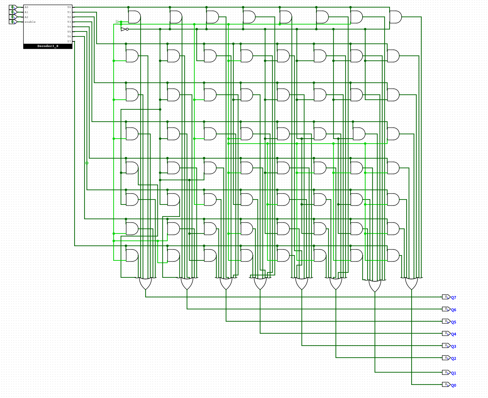

**2.实现GPR及其写入功能**

因为一共有4个寄存器，所以我们设计4x8的RAM(random access memory)
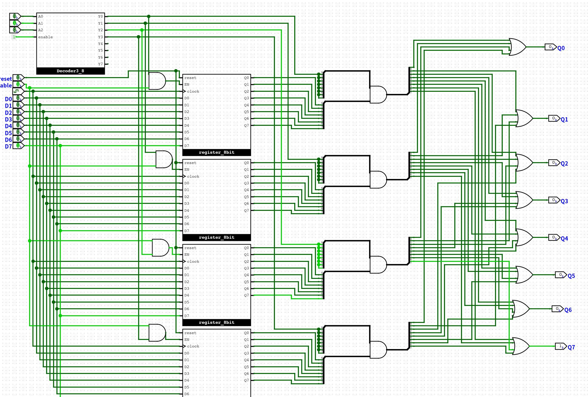

**3.实现仅支持li指令的sCPU**

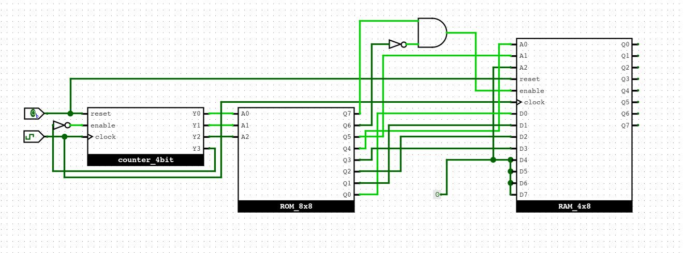
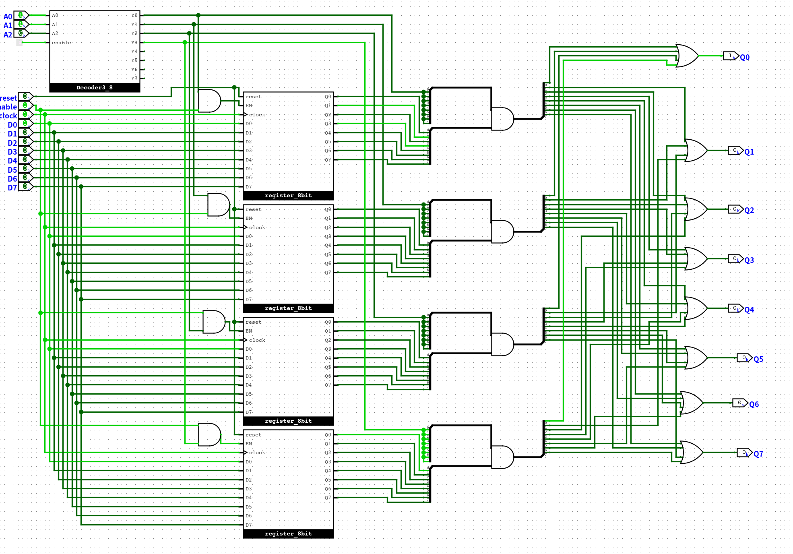
前3条加载正确

**4.添加add指令**

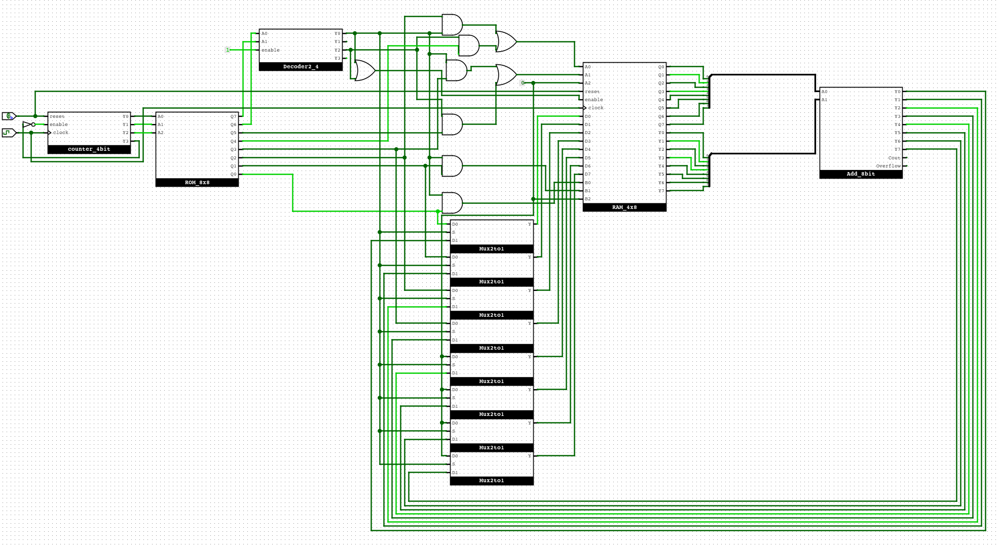
给ROM增加了一读口
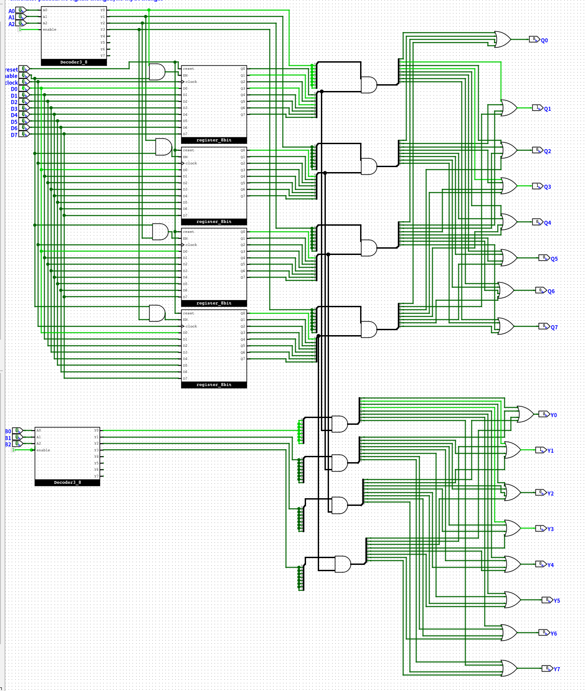
第4-5条指令加载正确

**5.添加bner0指令**

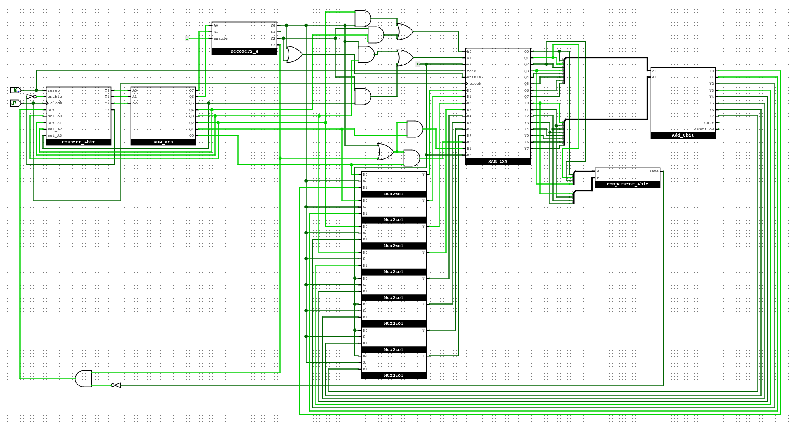
给计数器增加了置数功能
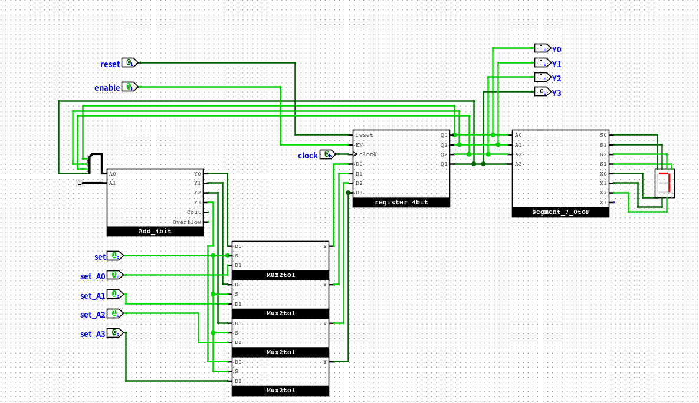
现在能完整跑完任务，最后r2存放最终结果55（110111），pc在7处死循环

**6.和数列求和电路进行对比**

之前的通过寄存器和加法器实现电路简答，可复用性低，而现在的sCPU通过指令集实现电路，可复用性高，且可扩展性强

**7.计算10以内的奇数之和**

```asm
10001001    # 0: li r0, 9
10010001    # 1: li r1, 1
10100001    # 2: li r2, 1
10110010    # 3: li r3, 2
00010111    # 4: add r1, r1, r3
00101001    # 5: add r2, r2, r1
11010001    # 6: bner0 r1, 4
11011111    # 7: bner0 r3, 7
```
更改ROM的内容，重新加载指令
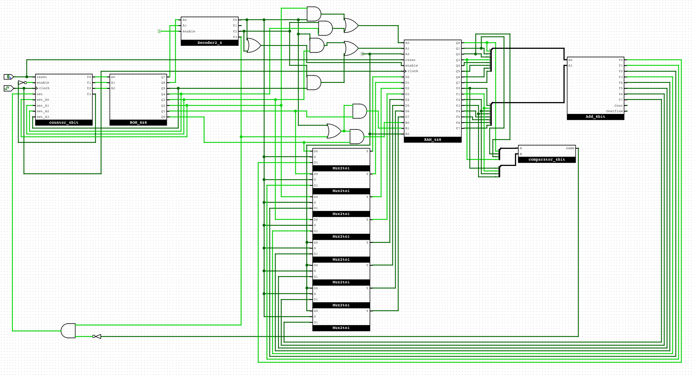
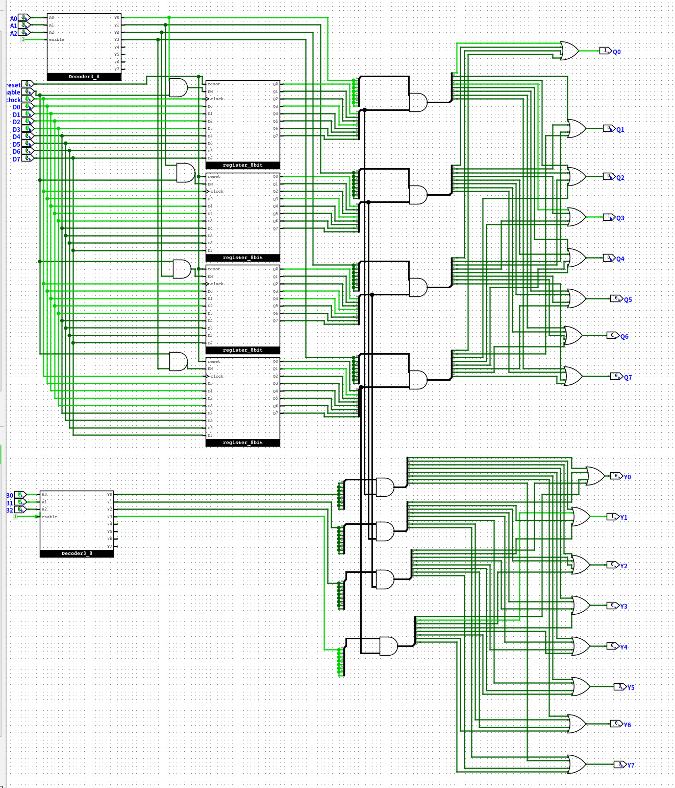
运行后，最终r2存放最终结果25（011001），pc在7处死循环
完成后, 我对计算机的"存储程序"思想有了更深刻的理解。存储程序思想的核心是将程序指令和数据存储在同一存储器中，使得计算机能够根据指令的顺序自动执行操作，而不需要人为干预。这种设计使得计算机具有高度的灵活性和可编程性。

**8.添加新指令**
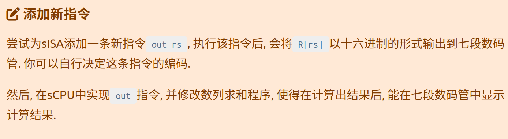
操作码用01
```txt
 7  6 5  4 3   2 1   0
+----+----+-----+-----+
| 00 | rd | rs1 | rs2 | R[rd]=R[rs1]+R[rs2]       add指令, 寄存器相加
+----+----+-----+-----+
| 10 | rd |    imm    | R[rd]=imm                 li指令, 装入立即数, 高位补0
+----+----------+-----+
| 01 | rd |           | R[rd]=imm                 读R[rd]到七段数码管显示器
+----+----+-----+-----+
| 11 |   addr   | rs2 | if (R[0]!=R[rs2]) PC=addr bner0指令, 若不等于R[0]则跳转
+----+----------+-----+
```
```asm
10001001    # 0: li r0, 9
10010001    # 1: li r1, 1
10100001    # 2: li r2, 1
10110010    # 3: li r3, 2
00010111    # 4: add r1, r1, r3
00101001    # 5: add r2, r2, r1
11010001    # 6: bner0 r1, 4
01101111    # 7: out r2
```
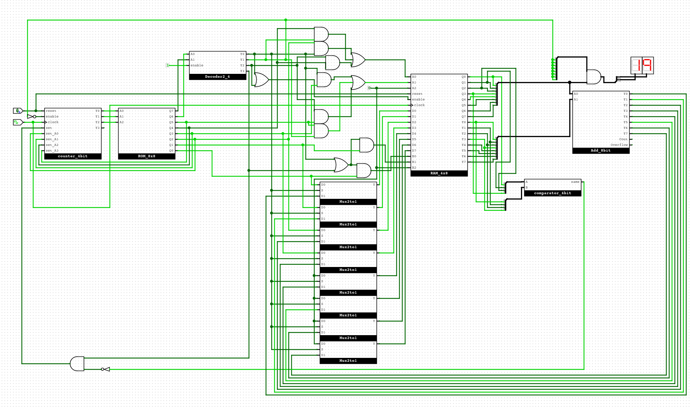
