**1.通过RTFM初步了解RISC-V指令集**
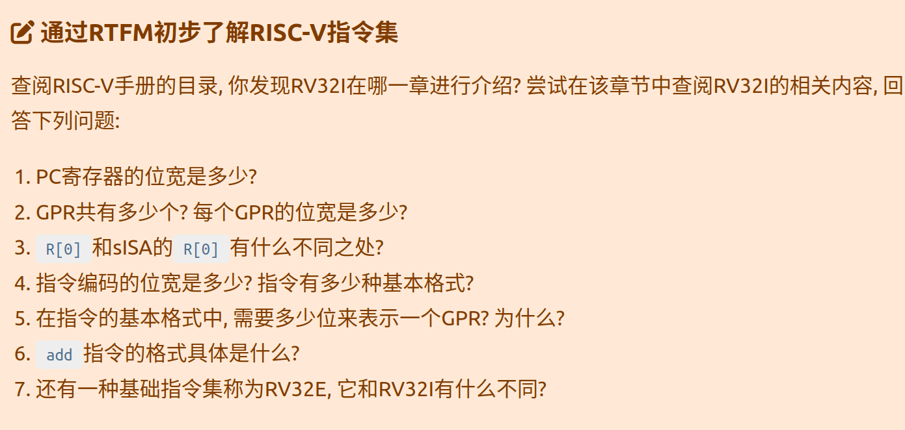
RV32I在第2章进行介绍：  
- PC寄存器的位宽是32位
- GPR共有32个 每个GPR的位宽是32位
>the 32 x registers are each 32
>bits wide
- R[0]不支持写入，R[0]的所有位始终为0，而sISA的R[0]可以被写入。
>register x0 is hardwired with all bits equal to 0.
- 指令编码的位宽是32位，有6种基本格式
>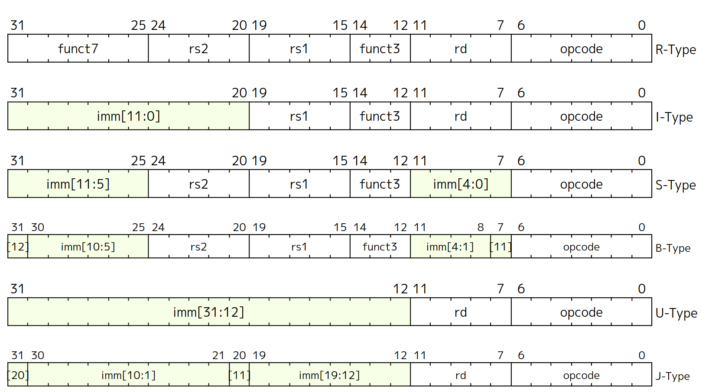
- 指令的基本格式中, 需要5位来表示一个GPR,因为32个寄存器，2^5=32。
- add指令的格式具体:
>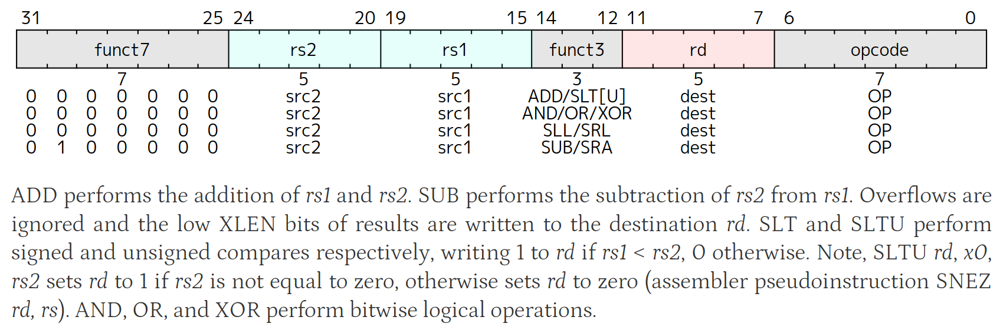
- 还有一种基础指令集称为RV32E, 它和RV32I的区别是GPR只有16个
>For resource-constrained embedded applications, we have defined the RV32E subset,
>which only has 16 registers

**2.RTFM(2)Add Immediate**
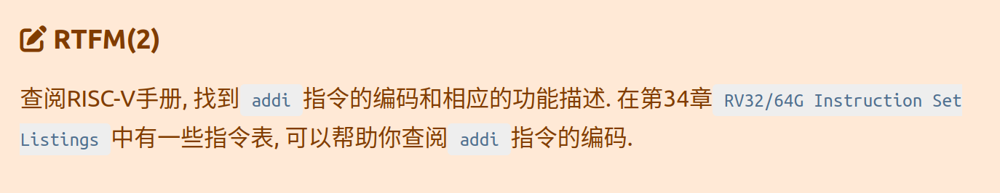
>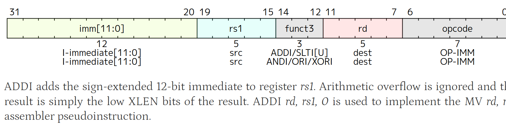
>
addi rd, rs1, imm  #x[rd] = x[rs1] + imm

**3.RTFM(3)**

>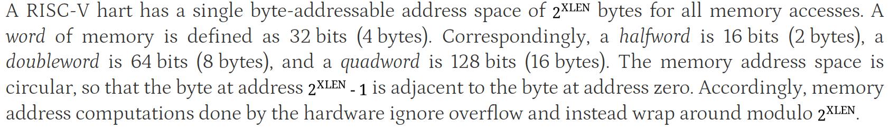
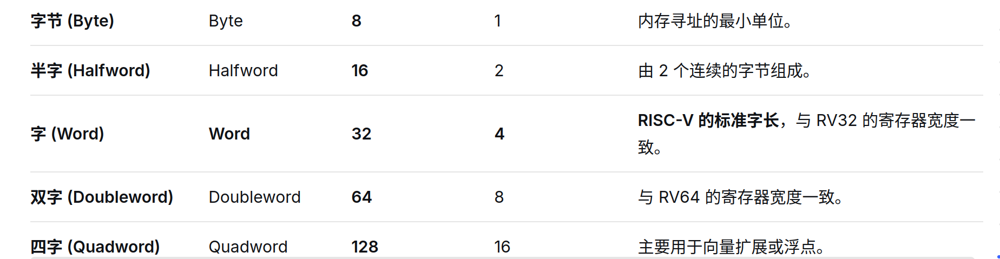

**4.RTFM(4)Jump And Link Register**

>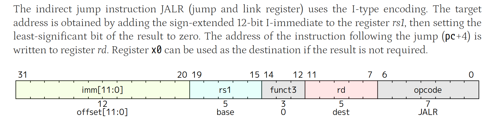
>

**5.实现两条指令的minirv处理器**
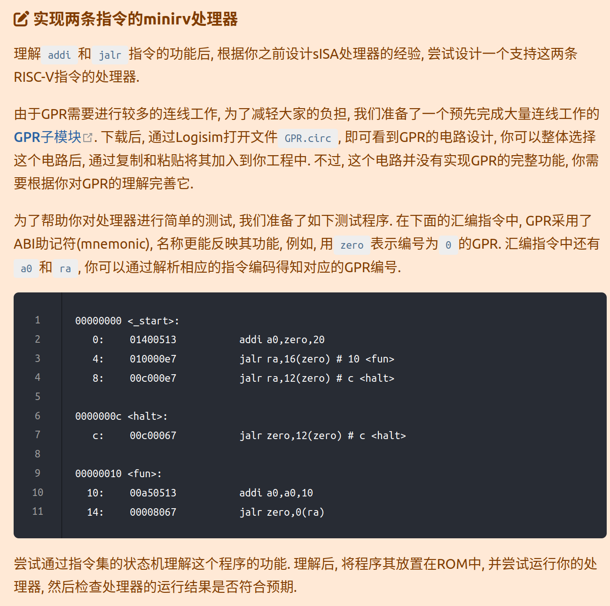
```asm
00000000 <_start>:
   0:	01400513          	addi	a0,zero,20
   4:	010000e7          	jalr	ra,16(zero) # 10 <fun>
   8:	00c000e7          	jalr	ra,12(zero) # c <halt>

0000000c <halt>:
   c:	00c00067          	jalr	zero,12(zero) # c <halt>

00000010 <fun>:
  10:	00a50513          	addi	a0,a0,10
  14:	00008067          	jalr	zero,0(ra)
```
```txt
  ├─ a0 = 20 (设置参数)
  │
  ├─ 调用 fun() → 跳转到 0x10，ra = 0x8 (返回地址)
  │     │
  │     ├─ a0 = a0 + 10 = 30 (修改参数/返回值)
  │     │
  │     └─ 返回 → 跳转到 ra (0x8)
  │
  └─ 调用 halt() → 跳转到 0x0c，ra = 0xc (返回地址)
        │
        └─ 死循环：跳转到 0x0c (自己)
```
取指：因为pc的单位是字节，所以pc每次自增4  
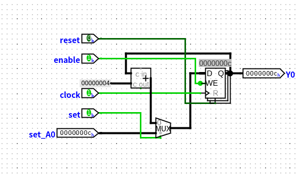  
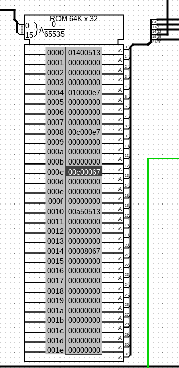  
译码：采用比较器  
is_addi = (inst[6:0] == 0010011) && (inst[14:12] == 000)  
is_jalr = (inst[6:0] == 1100111) && (inst[14:12] == 000)  
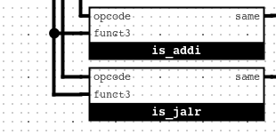  
GPR:
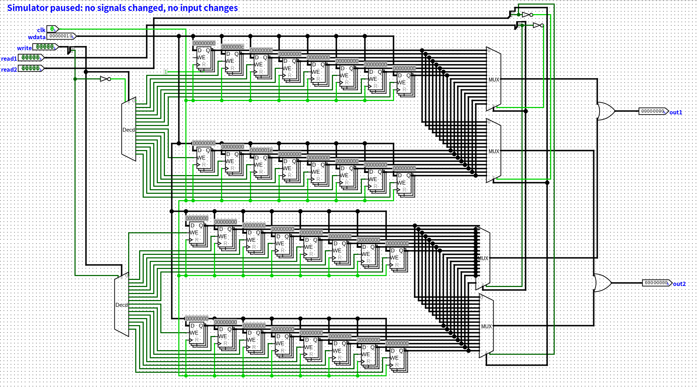  
总的：  
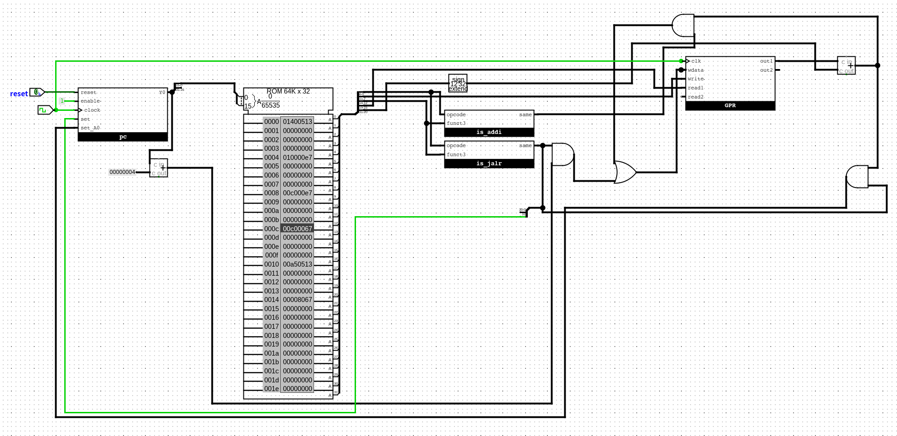
最后结果正确，pc在0x0c处死循环，a0=30,ra=0xc, 其他寄存器为0。   

**6.测试addi指令**

```asm
00000000 <_start>:
   0:	fec00513          	addi	a0,zero,-20
   4:	010000e7          	jalr	ra,16(zero) # 10 <fun>
   8:	00c000e7          	jalr	ra,12(zero) # c <halt>

0000000c <halt>:
   c:	00c00067          	jalr	zero,12(zero) # c <halt>

00000010 <fun>:
  10:	ff650513          	addi	a0,a0,-10
  14:	00008067          	jalr	zero,0(ra)
```
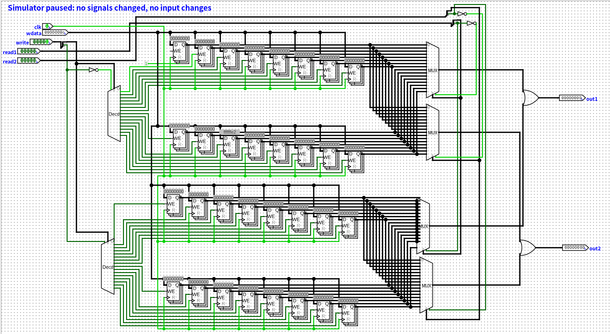
最后结果正确，pc在0x0c处死循环，a0=-30,ra=0xc, 其他寄存器为0。  

**7.实现完整的minirv处理器**

RTFM：  
LUI (load upper immediate)  
x[rd] = sext(imm20) << 12  
>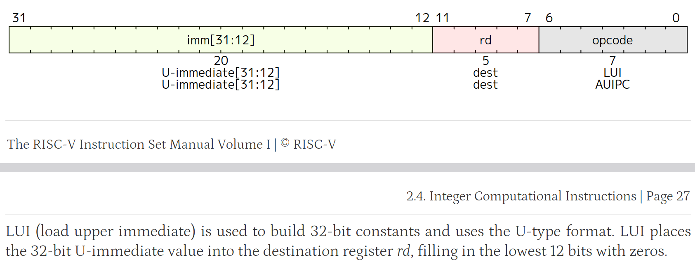
>
ADD:
x[rd] = x[rs1] + x[rs2]
>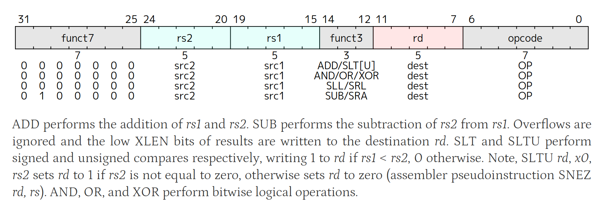
>
lui测试：
```asm
00000000 <_start>:
   0:	 0x00001537          	lui	a0,0x1   
```
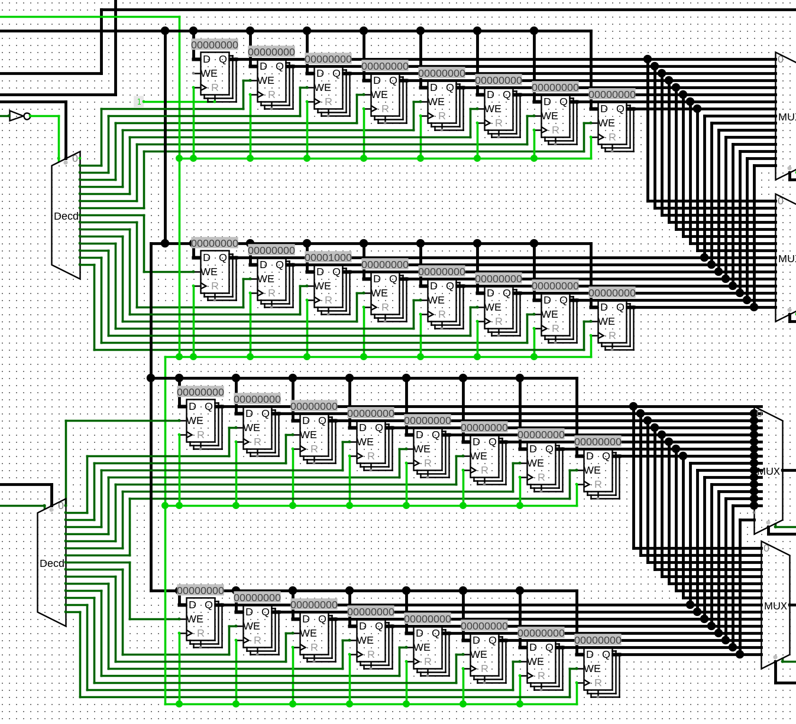
在a0(GPR[10])中存储了0x00001000，其他寄存器为0,符合预期
add测试：
```asm
00000000 <_start>:  
   0:	01400513          	addi	a0,zero,20
   4:	00a00593          	addi	a1,zero,10
   8:	00b50533             add	a0,a0,a1
```
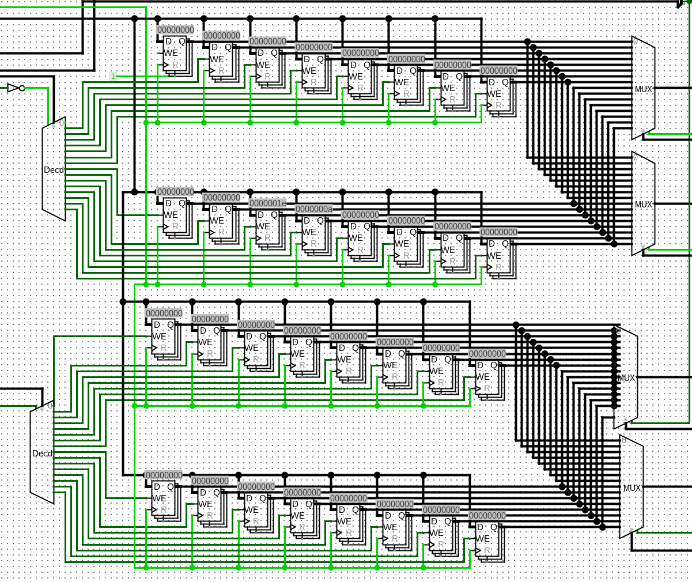
在a0(GPR[10])中存储了30，a1(GPR[11])中存储了10，其他寄存器为0，符合预期  

**8.RTFM(5)**
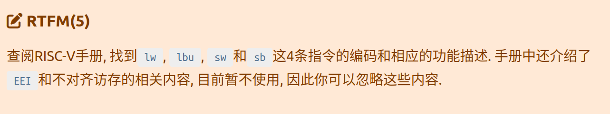
lw(load word):  
x[rd] = sext( M[ x[rs1] + sext(offset) ][31:0] )  

lbu:(load byte unsigned)

sw:(store word)  
[M[rs1 + imm]] = rs2

sb:(store byte)  
mem[rs1 + sext(offset)] = rs2[7:0]


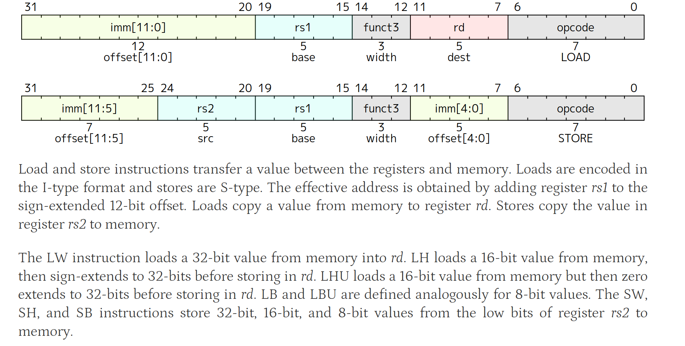

**9.实现完整的minirv处理器(2)**

lw测试：
```asm
00000000 <_start>:
   0: 01400593            addi a1,zero,20
   4: 0045a503            lw   a0,4(a1)
```
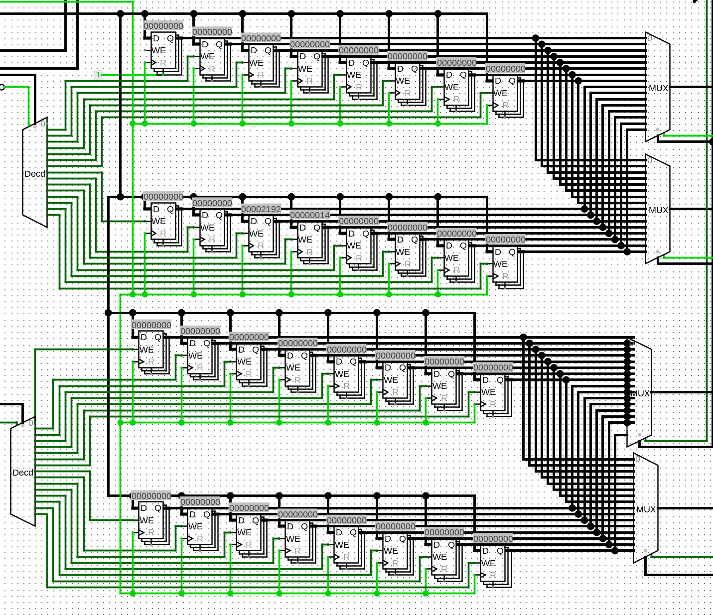
在a0(GPR[10])中存储了RAM里设计的数据0x00002192，a1(GPR[11])中存储了20，其他寄存器为0，符合预期。
sw测试：
```asm
00000000 <_start>:
   0: 01400593            addi a1,zero,20
   4: 01400513            addi a0,zero,20
   8: 0045a023            sw   a0,4(a1)
```
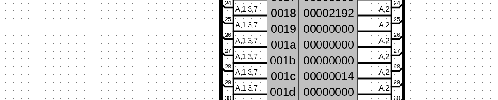
在RAM里地址24处存储了0x00000014。

**10.实现完整的minirv处理器(3)**
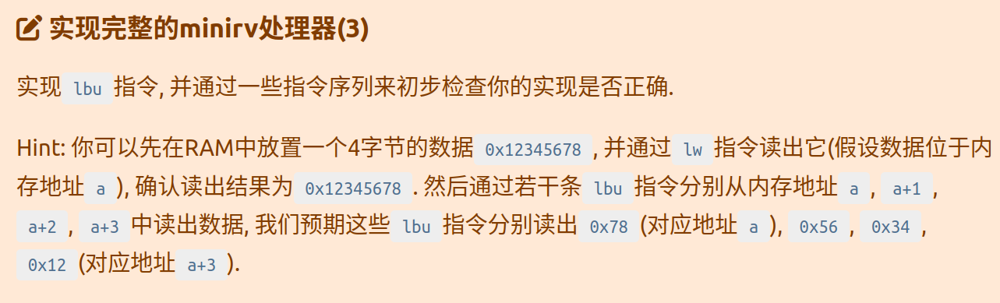
addr = rs1 + sext(offset);          // 计算地址
byte = Mem[addr][7:0];              // 读取 1 字节
rd = {24'b0, byte};                 // 高 24 位补 0，低 8 位为读取的字节
```asm
_start:
   0: 00408093             addi  x1, x1, 4         
   4: 0000a103             lw    x2, 0(x1) 
   8: 0000c183             lbu   x3, 0(x1)    
   c: 0010c203             lbu   x4, 1(x1)   
   10: 0020c283            lbu   x5, 2(x1)     
   14: 0030c303            lbu   x6, 3(x1)           
 ```   
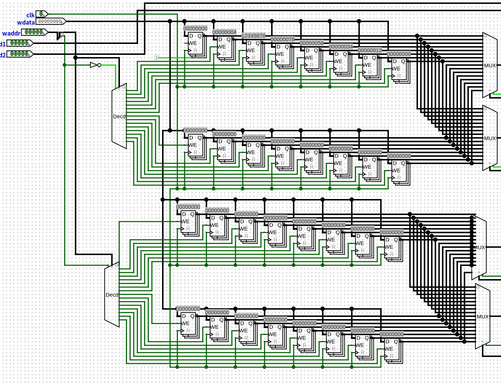
得到了理想结果

**11.实现完整的minirv处理器(4)**
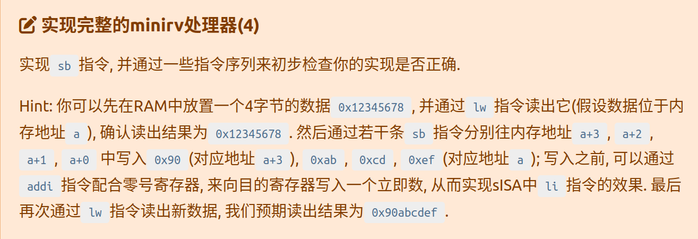  
byte_address = rs1 + sign_extend(offset)
mem[byte_address] = rs2[7:0]   // 只存储最低有效字节
```asm
_start:
   0: 00408093             addi  x1, x1, 4         
   4: 0000a103             lw    x2, 0(x1) 
   8: 0ef28293             addi  x5, x5, 0xef       
   c: 00508023             sb    x5, 0(x1)     
   10:0cd30313             addi  x6, x6, 0xcd   
   14:006080a3             sb    x6, 1(x1)
   18:0ab38393             addi  x7, x7, 0xab
   1C:00708123             sb    x7, 2(x1)
   20:09040413             addi  x8, x8, 0x90
   24:008081a3             sb    x8, 3(x1)   
```
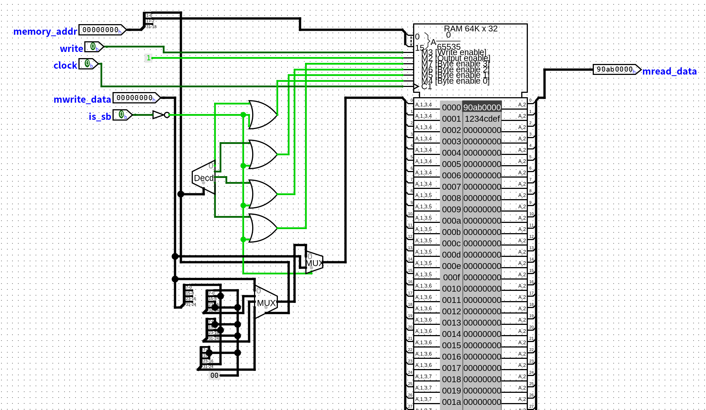
符合要求
 **12.在minirv处理器上执行C程序**
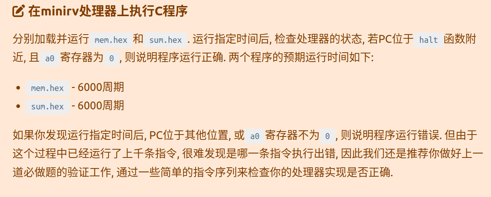
sum.hex

pc最后在0x224-0x228处死循环
mem.hex
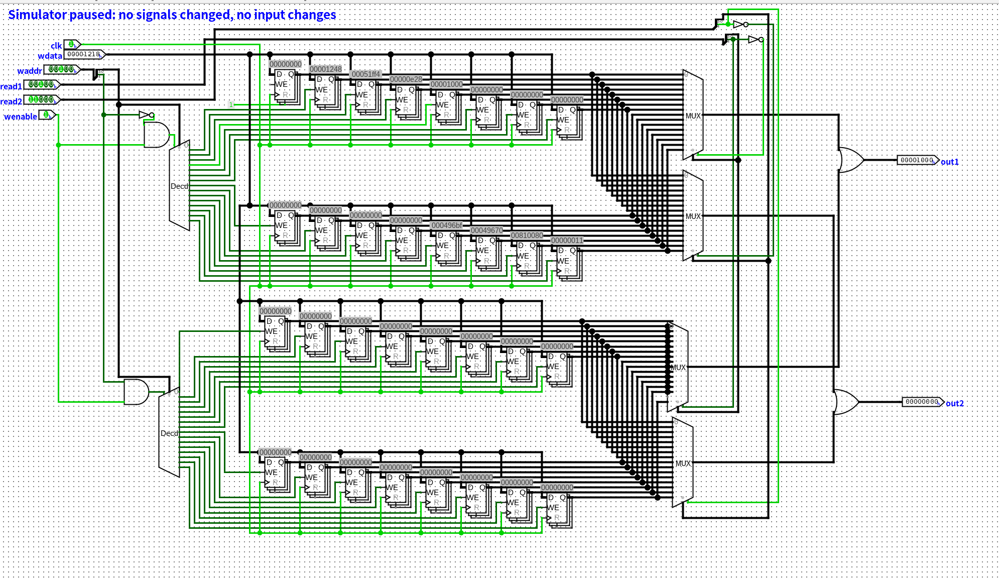
pc最后在1218，121c,1220处死循环  

**12.为minirv处理器添加图形显示功能**
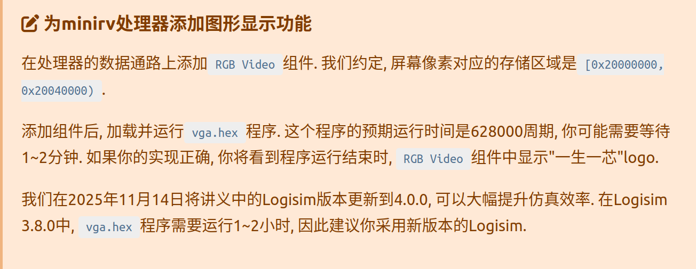
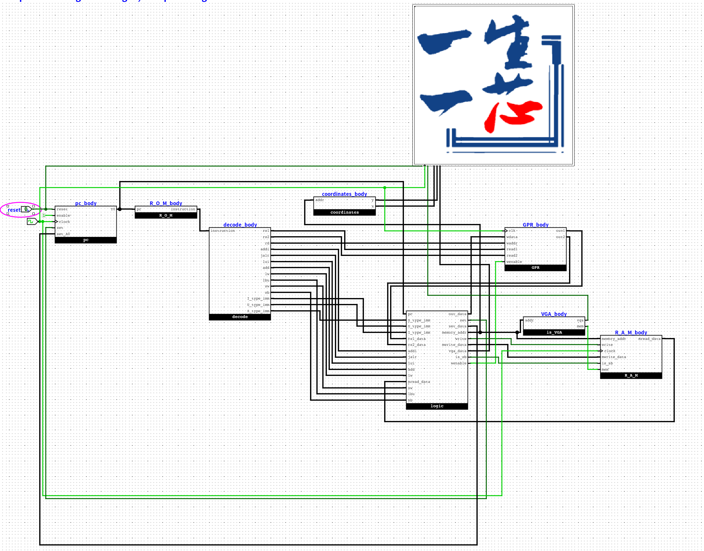